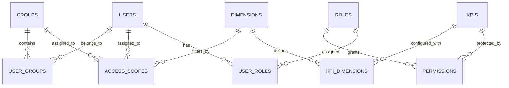

# RBAC & Row-Level Security (RLS) System Documentation

> **Status**: Production Ready (POC Verified)
> **Owner**: Engineering Team
> **Last Updated**: 2025-11-25

## 1. Executive Summary
This system provides a scalable, enterprise-grade **Role-Based Access Control (RBAC)** framework with granular **Row-Level Security (RLS)** for KPI data. It is designed to integrate seamlessly with **Azure AD** for authentication and supports complex enterprise workflows including **JIT Provisioning**, **Group-Based Access**, and **SME Delegation**.

---

## 2. Core Architecture

### 2.1 High-Level Flow
1.  **Authentication**: User logs in via Azure AD (JWT).
2.  **Role Mapping**: AD Groups are mapped to internal Application Roles (e.g., `sg-sales-managers` -> `REGIONAL_MANAGER`).
3.  **Permission Check**: System checks if the Role has `FULL` or `RESTRICTED` access to the requested KPI.
4.  **Scope Resolution**: If `RESTRICTED`, the system fetches specific data scopes (e.g., `Region=NA`) assigned to the User OR their Groups.
5.  **Data Filtering**: The KPI data is filtered at the database level (or application level) using these scopes.

### 2.2 Key Concepts
| Concept | Description | Example |
| :--- | :--- | :--- |
| **KPI** | A specific data resource or metric. | `Global Revenue`, `Churn Rate` |
| **Dimension** | An attribute used for filtering data. | `REGION`, `SITE`, `PRODUCT` |
| **Role** | Defines *what* KPIs a user can access. | `GLOBAL_VIEWER` (Full), `REGIONAL_MANAGER` (Restricted) |
| **Permission** | Links a Role to a KPI with an Access Type. | `Manager` has `RESTRICTED` access to `Revenue` |
| **Scope** | Defines *which subset* of data is visible. | `Region: NA`, `Site: NY-HQ` |
| **Group** | A collection of users that can share Scopes. | `Sales-NA` group has `Region: NA` scope |

---

## 3. Enterprise Workflows

### 3.1 Authentication & Onboarding (JIT)
*   **Trigger**: User logs in for the first time with a valid Azure AD JWT.
*   **Process**:
    1.  System verifies JWT signature.
    2.  Extracts `email` and `groups` claim.
    3.  **Just-In-Time (JIT)**: Creates the user record in the local DB if it doesn't exist.
    4.  **Role Sync**: Maps AD Groups to internal Roles (clearing previous roles to ensure sync).

### 3.2 Dynamic Scope Assignment (Delegation)
*   **Scenario**: A Regional Manager needs access to a specific region's data.
*   **Actor**: Subject Matter Expert (SME) or Admin.
*   **Action**: SME assigns a specific **Scope** (e.g., `Region=EMEA`) to the User (or a Group they belong to).
*   **Result**: The user immediately gains access to data matching that scope.

### 3.3 Group-Based Access
*   **Scenario**: A new sales team for "North America" is formed.
*   **Setup**:
    1.  Create a Group `Sales-NA`.
    2.  Assign Scope `Region=NA` to the Group.
    3.  Add Users to the Group.
*   **Benefit**: All users in the group inherit the `Region=NA` scope. Adding a new user to the group automatically grants them access.

---

### 3.4 SME & Governance Model
The system distinguishes between **System Admins** (IT) and **Subject Matter Experts (SMEs)** (Business).

#### Who is an SME?
An SME is a business user responsible for defining *who* can see *what* data within their specific domain (e.g., a Sales Director for the "Sales KPI").

#### How to become an SME?
SME status is granted via **Role Assignment**, typically automated through Azure AD Groups.
1.  **IT/Identity Team** adds the user to a specific AD Group (e.g., `sg-kpi-owners-sales`).
2.  **System** maps this group to the `KPI_OWNER` role during login.
3.  **Result**: The user gains access to the "Access Management" UI for their KPIs.

#### SME Responsibilities
*   **Define Scopes**: Assign `Region=NA` to a new "North America Sales" group.
*   **Approve Requests**: Review and approve/deny access requests for their KPIs.
*   **Audit**: Periodically review who has access to their data.

#### Differentiation
| Role | Responsibility | Scope |
| :--- | :--- | :--- |
| **Admin** | System Health, Integrations, Global Config | Full System |
| **SME** | Data Access Policy, Scope Assignment | Specific KPIs |
| **User** | Viewing Data | Assigned Scopes |

---

## 4. Database Schema
The system uses a normalized relational schema (SQLite for POC, PostgreSQL ready).



*   **`users`**: Core identity.
*   **`roles`**: Functional roles (Admin, Analyst).
*   **`permissions`**: `role_id` + `kpi_id` + `access_type` ('FULL'/'RESTRICTED'/'OWNER').
*   **`access_scopes`**: `entity_type` ('USER'/'GROUP') + `entity_id` + `dimension_id` + `value`.
*   **`groups`**: Internal groups for scope management.

---

## 5. Integration Guide

### 5.1 Checking Access
Use the unified `getKPIAccess` function in your controllers.

```javascript
const { getKPIAccess } = require('./services/rbac.service');

// In your API Controller
const access = getKPIAccess(currentUser, kpiId);

if (!access) {
  return res.status(403).json({ error: 'Access Denied' });
}

if (access.type === 'FULL') {
  // Return ALL data
  return res.json(allData);
} else {
  // Apply RLS Filters
  // access.filters = { region: ['NA'], site: ['NY-HQ'] }
  const filteredData = applyFilters(allData, access.filters);
  return res.json(filteredData);
}
```

### 5.2 Optimizations
*   **Single Query**: The `getKPIAccess` function fetches Permissions, User Scopes, and Group Scopes in a **single optimized SQL query**.
*   **Caching**: Results are cached in-memory (configurable TTL) to minimize database load.

---

## 6. Future Roadmap
*   **UI Management**: Build a frontend for SMEs to manage Scopes and Groups.
*   **Audit Logging**: Enhance `audit_logs` to track every scope change and access denial.
*   **External Sync**: Automate Group synchronization from Azure AD (SCIM).
